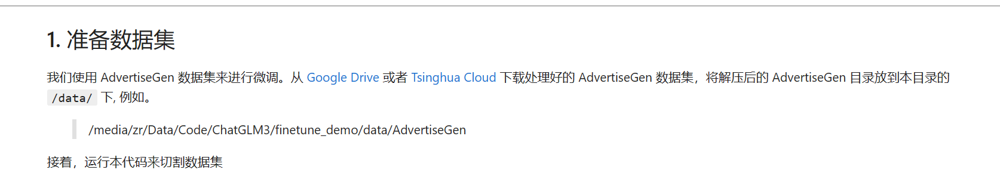
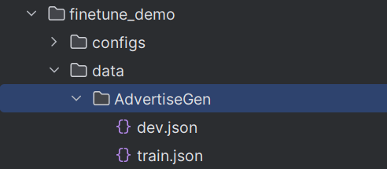
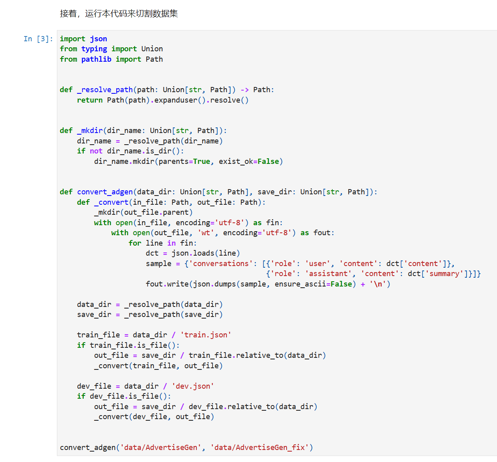
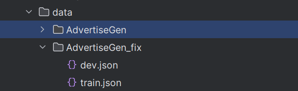
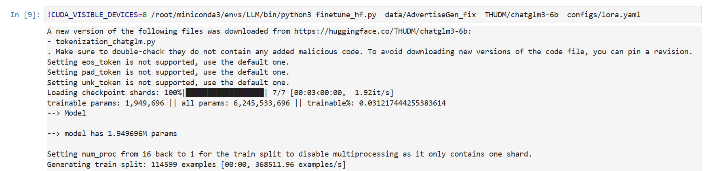
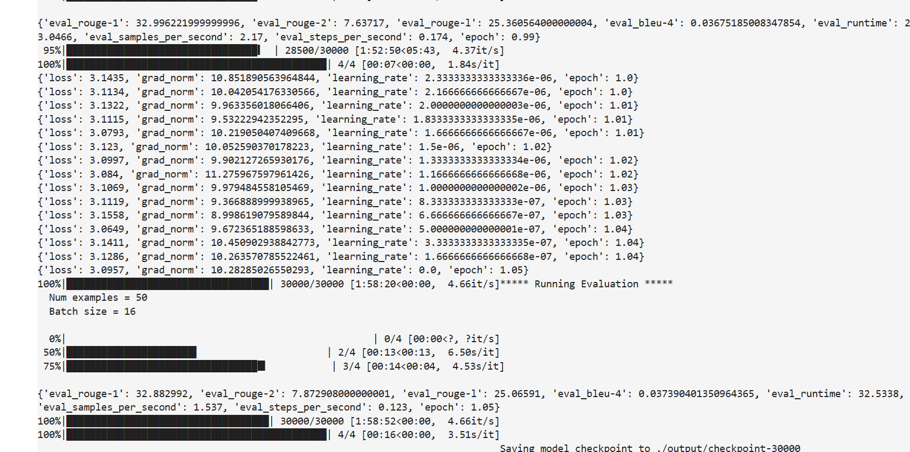
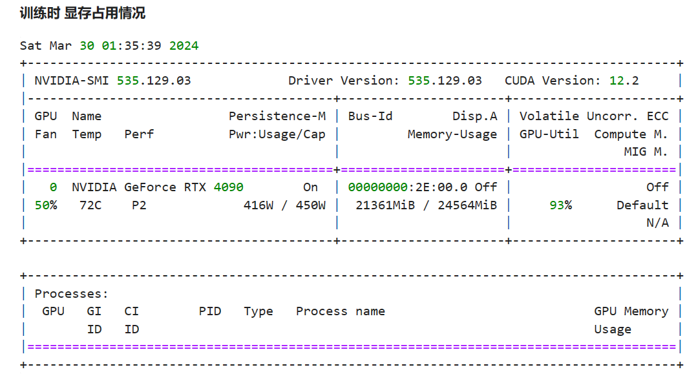
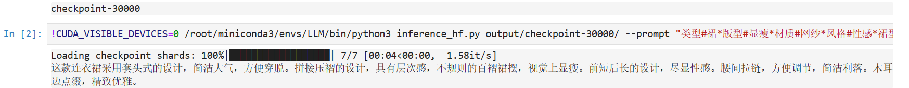
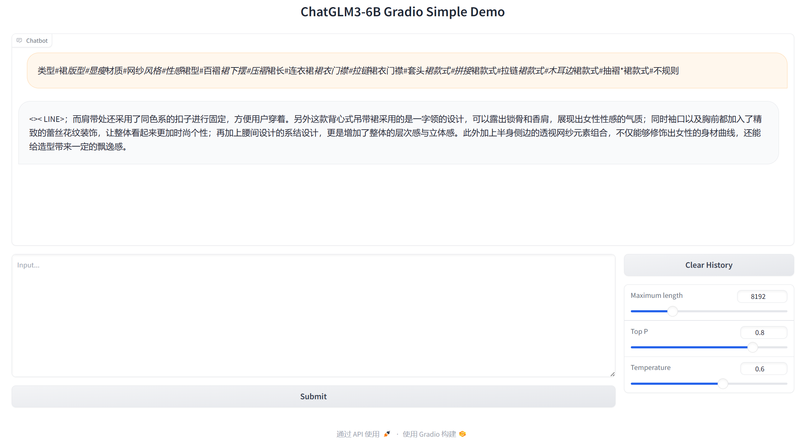
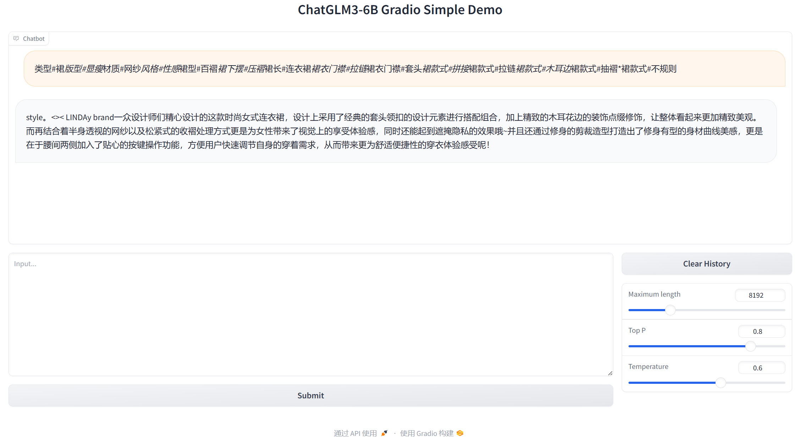

# ChatGLM3-Homework(智谱作业)

## 使用官方提供的示例，成功微调出广告数据集，要求使用 Lora 进行微调：

1. 你能看到 loss 的下降，并在最终回到 3.2 左右。
2. 你需要自己适配 inference.py 中的代码，并迁移到其他的推理框架中。例如，basic_demo 中没有读取微调模型后的 adapter 的内容，你需要参考 inference.py 的代码并进行修改，让其他 demo 能读入你的微调代码，将其部署到 basic_demo 下的 gradio_demo 中，并能够通过 webui 来进行调用

## 1. 首先下载官方项目
```bash
git clone https://github.com/THUDM/ChatGLM3.git
```

## 2. 安装项目依赖
```bash
cd ChatGLM3/
pip3 install -r requirements.txt
```

# 接下来我们微调 ChatGLM3
打开项目文档 finetune_demo/lora_finetune.ipynb 作为参考，依次执行。

## 1. 下载数据集



**下载后的文件如下：**



## 2. 接着，执行数据切割，使其数据格式调整为符合 ChatGLM3 对应的微调数据格式



**切割后的数据集如下：**



## 3. 通过修改配置文件参数 以及 使用AdvertiseGen_fix 数据集，命令行执行 finetune_hf.py ,LoRA 微调 ChatGLM3
```bash
!CUDA_VISIBLE_DEVICES=0 /root/miniconda3/envs/LLM/bin/python3 finetune_hf.py  data/AdvertiseGen_fix  THUDM/chatglm3-6b  configs/lora.yaml
```


**这里我们调整了configs/lora.yaml 的执行步数，让他执行30000步**

执行完后，我们看到 loss 从最初的 4.0 降到了 3.1 左右的样子



**注意看看自己的显存大小，我这里占用了差不多22G的样子**



## 接着，使用我们微调后的 LoRA 模型，通过命令行调用 inference_hf.py 进行模型推理，看看效果怎么样
```bash
!CUDA_VISIBLE_DEVICES=0 /root/miniconda3/envs/LLM/bin/python3 inference_hf.py output/checkpoint-30000/ --prompt "类型#裙*版型#显瘦*材质#网纱*风格#性感*裙型#百褶*裙下摆#压褶*裙长#连衣裙*裙衣门襟#拉链*裙衣门襟#套头*裙款式#拼接*裙款式#拉链*裙款式#木耳边*裙款式#抽褶*裙款式#不规则"
```

我们看到微调后的模型被成功调用并得出了相对满意的结果

---

# 通过 WebUI 来使用微调后的模型
webui 的参考示例在 basic_demo/ 目录文件夹下，这里我们使用 Gradio 来作为前端展示的方式

## 基础模型的调用
直接执行命令
```bash
python web_demo_gradio.py
```
我们试试看


**由于官方是没有适配调用 微调后模型 的能力，这里我们自己适配下**

适配思路：在命令行执行时 将模型的路径传入，这样我们就可以指定加载那个模型来用作推理模型使用

具体为 引入 --model_path 命令行参数，用于接收模型路径

故 web_demo_gradio.py 代码增加以下代码：
```python
def parse_args():
    """解析命令行参数"""
    parser = argparse.ArgumentParser(description="运行Gradio界面并加载模型")
    parser.add_argument('--model_path', type=str, default='THUDM/chatglm3-6b',
                        help='模型路径')
    return parser.parse_args()


# 解析命令行参数
args = parse_args()
```

修改后，我们再执行下以下命令试试看（指定微调后的模型路径为：output/checkpoint-30000/）：
```bash
python web_demo_gradio.py --model_path output/checkpoint-30000/
```


这里的 output/checkpoint-30000/ 就是我们上面 LoRA 微调后的模型路径，看到模型被成功加载 并 执行，并且同样的提示词，明显后者（微调后）的文本更优秀一些

至此 我们就完成ChatGLM的基础学习部分啦！


